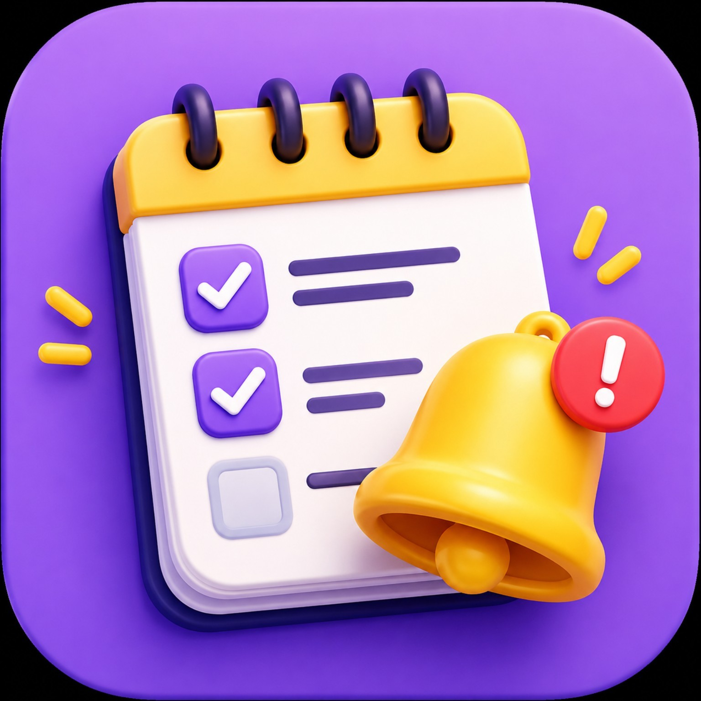

# 📅 Meus Lembretes

Aplicativo de lembretes completo, leve e moderno, feito para funcionar diretamente no navegador e poder ser instalado como **PWA (Progressive Web App)**.



## ✨ Recursos

- Criação de lembretes com prioridade
- Prazos com data e hora
- Lembretes diários e mensais
- Anexos de imagens e arquivos
- Calendário e organização dos lembretes
- Temas e modo dia/noite
- Aviso de vencimento em popup
- Cada vencimento é tratado individualmente
- Opção de marcar como resolvido ou adiar por 24 horas
- Armazenamento local no dispositivo
- Instalação como aplicativo pelo navegador

## 🚀 Publicar no GitHub Pages

1. Crie um repositório no GitHub.
2. Envie **todos os arquivos desta pasta** para a raiz do repositório.
3. Em **Settings → Pages**, escolha **Deploy from a branch**.
4. Selecione a branch `main` e a pasta `/ (root)`.
5. Salve e aguarde o GitHub Pages publicar.
6. Abra o endereço gerado no celular.
7. No navegador, use **Adicionar à tela inicial / Instalar app**.

O arquivo `index.html` é a entrada principal. O `manifest.json` e o `sw.js` permitem a instalação como PWA.

## 📱 Instalação no Android

Depois que o GitHub Pages estiver publicado, abra o site no Chrome. Quando disponível, use **Instalar aplicativo** ou **Adicionar à tela inicial**.

## 📁 Estrutura

```text
Meus-Lembretes-GitHub/
├── index.html
├── 31.html
├── manifest.json
├── sw.js
├── capa.png
├── .nojekyll
├── icons/
│   ├── icon-192.png
│   └── icon-512.png
└── README.md
```

## Licença

Projeto pessoal. Defina a licença desejada no repositório antes de publicar como código aberto.
